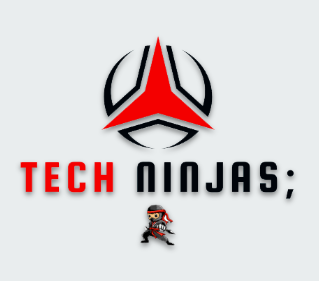

<h1 align="center">#Quer Carona?</h1>
 
<h2 align="center">Equipe</h2>

<h2 align="center">Projeto</h2>
<h4 align="center">
🚧 Projeto README 🚀 Em construção ... 🚧
</h4>

 

 

  
  
  

 

Projeto Integrador I/II e Programação para Internet I/II - IFPI - Picos - 2022

